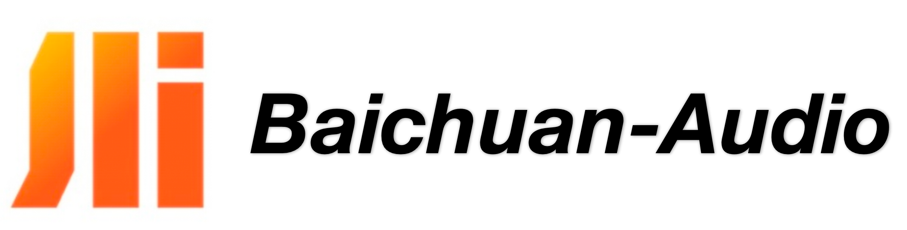
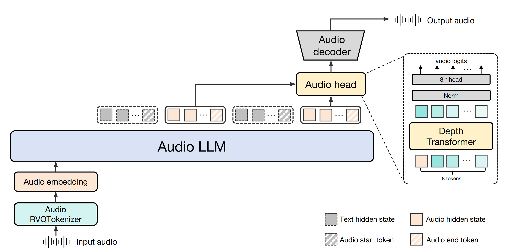
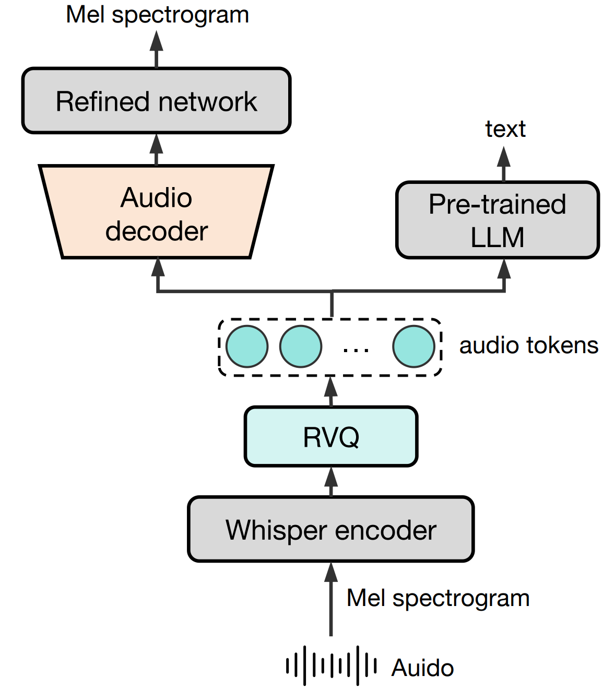
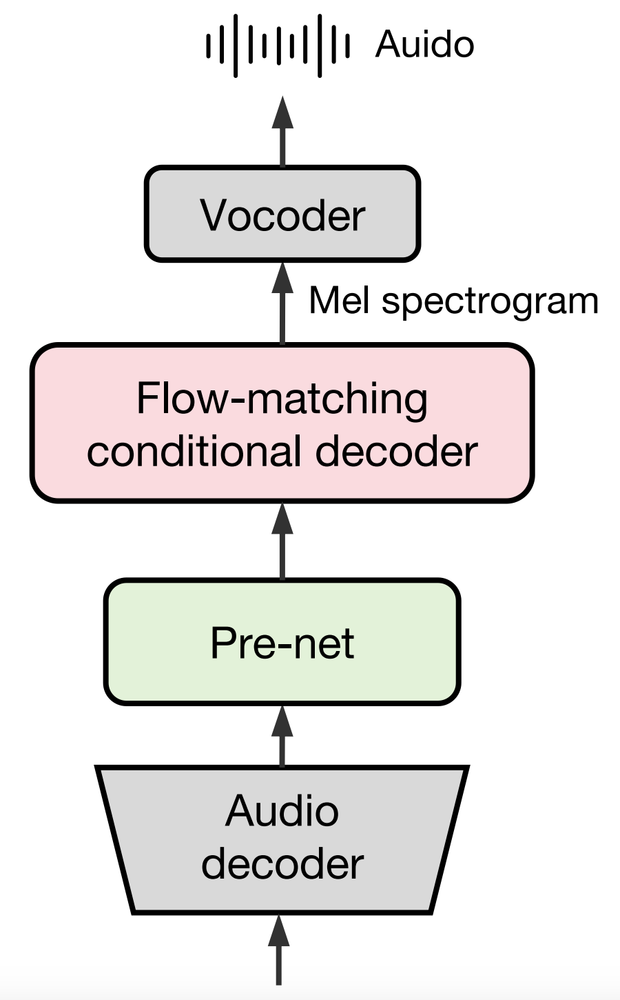
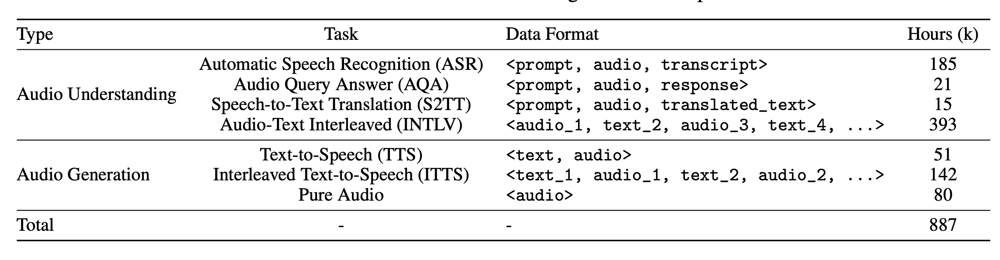
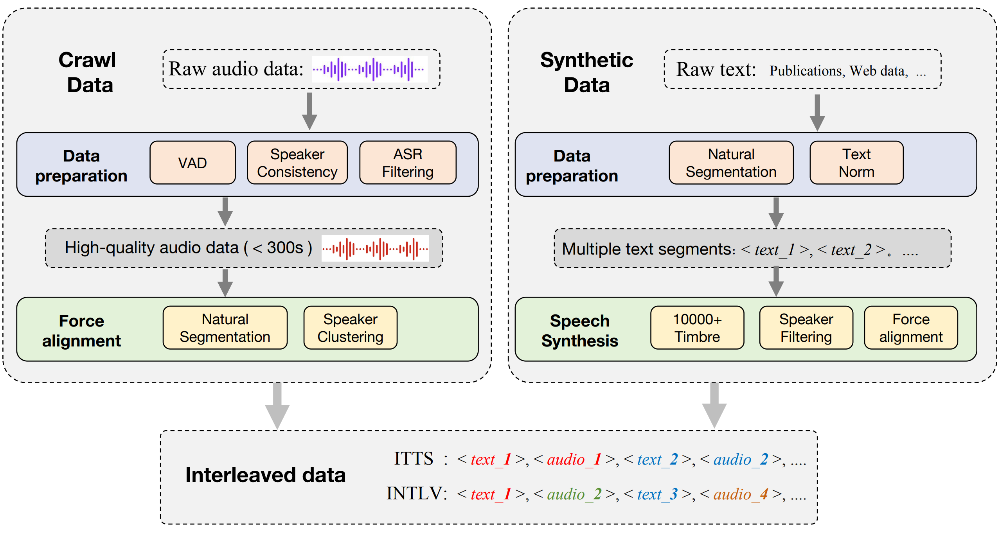
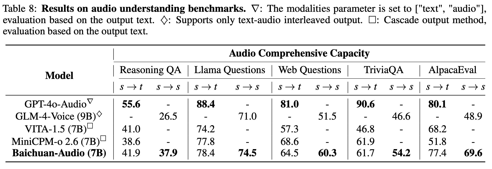

<div align="center">

</img> 

## **开源端到端语音交互基座**

  <strong>中文 |
  [English](./README.md)</strong>
  
  <p align="center">
  Baichuan-Audio <a href="https://huggingface.co/baichuan-inc/Baichuan-Audio-Instruct">🤗</a> | Baichuan-Audio-Base <a href="https://huggingface.co/baichuan-inc/Baichuan-Audio-Base">🤗</a>  | 技术报告 <a href="https://arxiv.org/abs/2501.15368">📖</a> 
</p>
</p>
<p align="center">
OpenAudioBench <a href="https://huggingface.co/datasets/baichuan-inc/openAudioBench">🤗</a>  | 训练数据 <a href="#">🤗</a> <small>(Coming Soon)</small>
</p>

  <!-- <p align="center">
    OpenMM-Medical <a href="https://huggingface.co/datasets/baichuan-inc/OpenMM_Medical">🤗</a> | OpenAudioBench <a href="https://huggingface.co/datasets/baichuan-inc/OpenAudioBench">🤗</a> 
</p> -->
</div>

## Baichuan-Audio

**Baichuan-Auido** 是Baichuan最新的端到端训练的语音交互大模型，无缝集成了音频理解和生成功能，支持高质量可控的中英双语实时对话。

- **Baichuan-Audio-Base**: 为促进语音大模型发展，我们开源了使用高质量海量数据训练的端到端语音基座模型。该模型未经SFT指令微调，可塑性强。

- **Baichuan-Audio**: 接受文本、音频作为输入，并生成高质量文本和语音输出，能够**在保持预训练LLM智商能力下实现无缝的高质量语音交互，和用户进行实时语音对话**。

- 同时，我们还开源了音频理解和生成基准（OpenAudio-Bench），以评估音频的端到端能力。此外，预训练数据也即将开源。


<br>

### Model Architecture

<div align="center">

</div>
<br>

**Baichuan-Auido** 主要由 Baichuan-Audio Tokenizer、Audio LLM 和Flow-matching based Audio Decoder 三部分组成。首先语音通过Baichuan-Audio Tokenizer转换为离散音频 token。然后，Audio LLM 以交错方式生成对齐的文本和音频 token，并通过特殊 token 实现文本和音频之间的无缝模态切换。音频 token 由独立的 audio head 处理，并用基于流匹配的音频解码器重建高质量的梅尔频谱图，最后通过声码器将其转换为音频波形。

- Baichuan-Audio-Tokenizer 采用 12.5hz 帧率设计。其使用 Whisper Large Encoder 从 Mel 谱中提取高级音频特征，然后使用 8 层 RVQ 来最大限度地减少量化过程中的信息损失。为了同时捕获捕获语义和声学信息，我们分别通过 Mel 谱重构和 Pre-trained LLM 进行声学和语义监督。
<div align="center">

</div>

- Audio LLM 以交错方式生成对齐的文本和音频 token，并通过特殊 token 实现文本模态和音频模态之间的无缝切换。音频 token 由独立的 audio head 处理。

- Flow-matching based Audio Decoder用来重建高质量的梅尔频谱图。该模型在 24 kHz 音频上进行训练以生成目标梅尔声谱图。最后通过声码器将其转换为音频波形。

<div align="center">

</div>


### Pre-training details
- #### Pre-training data
音频训练数据大致可分为两种主要类型：音频理解数据和音频生成数据。
<div align="center">

</div>

音频文本配对数据（例如 ASR 和 TTS 数据）可提高基本语音任务的性能。另一方面，纯音频数据增强了独立处理音频模态的能力。Audio-Text Interleaved 数据由交替的文本和音频模态组成，由标点符号分割以促进跨模态知识传递。Interleaved Text-to-Speech 数据由完全对齐的文本和音频内容组成，旨在增强模型在文本监督下生成音频 token 的能力。

交错数据采集流程分为爬取和合成两种类型，共计获得了 142k 小时的 ITTS 数据和 393k 小时的 INTLV 数据。
<div align="center">

</div>

<br>

- #### Two stage training strategy
语音模态与文本模态之间的冲突可能会干扰预训练LLM中预训练的文本知识表征，从而导致模型智商性能退化。为此，我们采用了一种两阶段训练策略来缓解模态之间的训练冲突。在第一阶段，LLM 的参数保持不变，只更新 audio embedding layer 和 audio head 的参数。在第二阶段，除LM embedding layer 和 LM head 的参数外，所有参数都参与训练。


### 本地 WebUI Demo

#### 准备工作

##### 创建虚拟环境
```bash
conda create -n baichuan_omni python==3.12
conda activate baichuan_omni
pip install torch==2.4.0 torchvision==0.19.0 torchaudio==2.4.0 --index-url https://download.pytorch.org/whl/cu124
pip install -r baichuan_omni_requirements.txt
pip install accelerate flash_attn==2.6.3 speechbrain==1.0.0 deepspeed==0.14.4
apt install llvm ffmpeg
```
##### 下载模型并修改模型路径
修改 web_demo/constants.py 中的 MODEL_PATH 为本地模型路径

#### ASR and TTS Demo

```bash
cd web_demo
python base_asr_demo.py
python base_tts_demo.py
```
#### Speech interaction Demo

```bash
cd web_demo
python s2s_gradio_demo_cosy_multiturn.py
```


### 开源评测集

**OpenAudioBench**

为了更高效的评估模型的“智商”问题，我们构建了 OpenAudioBench，共包含5个音频端到端理解子评测集，分别是4个公开评测集（llama question、WEB QA、TriviaQA、AlpacaEval），以及百川团队自建的语音逻辑推理评测集，共2701条数据，能够综合反映模型“智商”水平。

### 模型性能

<div align="center">

</div>


### 致谢

- 自动语音识别（ASR, Automatic Speech Recognition）模型：【Whisper】(https://github.com/openai/whisper)
- 大语言模型（LLM）：【Qwen2.5 7B】(https://arxiv.org/abs/2412.15115)
- 部分代码来自：CosyVoice和Matcha-TTS：(https://github.com/FunAudioLLM/CosyVoice, https://github.com/shivammehta25/Matcha-TTS/)
- 使用CosyVoice 2.0中的HiFi-GAN vocoder：(https://funaudiollm.github.io/cosyvoice2/)


### 协议
Baichuan-Audio-Base/Baichuan-Audio 模型的权重的使用则需要遵循 [模型协议](https://huggingface.co//baichuan-inc/Baichuan-Audio/blob/main/LICENSE) 和 [Apache 2.0](https://github.com/baichuan-inc/Baichuan-Audio/blob/main/LICENSE)

### 引用
如果您觉得我们模型/代码/论文有帮助，请给我们 ⭐ 和 引用 📝，感谢！

```bib
@article{li2025baichuan,
  title={Baichuan-Omni-1.5 Technical Report},
  author={Li, Yadong and Liu, Jun and Zhang, Tao and Chen, Song and Li, Tianpeng and Li, Zehuan and Liu, Lijun and Ming, Lingfeng and Dong, Guosheng and Pan, Da and others},
  journal={arXiv preprint arXiv:2501.15368},
  year={2025}
}
```